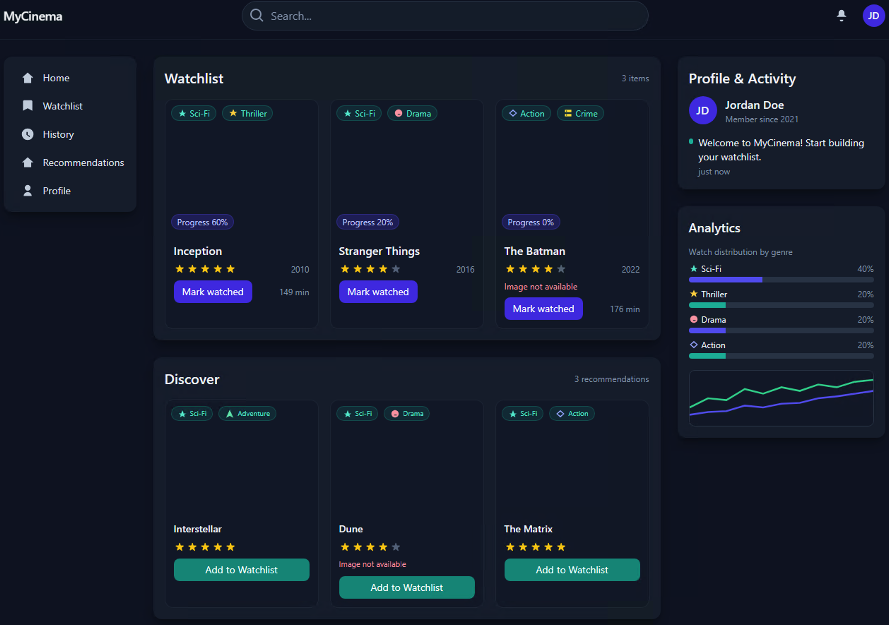

# My Cinema


Lightweight movie & TV tracking platform: a FastAPI backend (SQLite demo) with endpoints for users, watchlists, ratings & reviews, viewing history, friends, notifications, and basic analytics; includes an in-memory demo and a React UI prototype for quick testing and exploration.

## Run frontend

Quick preview (serve static files):

```powershell
npx serve .
```

## Run backend

Start the FastAPI backend (SQLite demo):

```powershell
python main.py
# or run with uvicorn directly:
.\.venv\Scripts\python.exe -m uvicorn main:app --reload --host 127.0.0.1 --port 8000
```


## What this repo contains
- `main.py` — FastAPI app backed by SQLAlchemy and a local SQLite DB (`artifacts/onboarding.db`).
- `artifacts/app/main_in_memory.py` — Minimal in-memory FastAPI example (no DB).
- `artifacts/schema.sql` and `artifacts/seed_data.sql` — Database schema and seed data for onboarding/demo.
- `artifacts/onboarding.db` — Example local SQLite DB (may be present in the repo for demo).
- `docs/adr/0001-architecture-decisions.md` — Architectural decisions and rationale.
- `SECURITY_VULNERABILITIES.md` — Security findings and recommended remediations.
- `AI_Code/` — Jupyter notebooks and utilities used in the labs and demos.
 - `docs/` — Documentation and ADRs (see `docs/adr/` for architectural decisions and notes).
 - `diagrams/` — PlantUML diagrams and ERD/sequence diagrams illustrating the system model.
 - `index.html` — Small static demo page that loads the React demo component via CDN (Babel + Tailwind) for quick UI preview.
 - `movie_dashboard.jsx` — A standalone React component (MyCinemaDashboard) used by `index.html`; UI prototype for watchlist, discovery, and analytics (not wired to the backend by default).

## Quick start (PowerShell)
These steps assume a Windows PowerShell environment and Python 3.11+.
1. Create and activate a virtual environment
```powershell
python -m venv .venv
.\.venv\Scripts\Activate.ps1
```
2. Install runtime dependencies
```powershell
pip install -r requirements.txt
```
3. Run the app (SQLite-backed example)
```powershell
python main.py
# or run with uvicorn directly:
.\.venv\Scripts\python.exe -m uvicorn main:app --reload --host 127.0.0.1 --port 8000
```
4. Or try the in-memory example
```powershell
python artifacts\app\main_in_memory.py
```
## Database notes
- The example `main.py` uses SQLite by default: `sqlite:///./artifacts/onboarding.db`.
- If you want to recreate the DB from the SQL files you can run (requires `sqlite3` CLI):

```powershell
sqlite3 .\artifacts\onboarding.db < .\artifacts\schema.sql
sqlite3 .\artifacts\onboarding.db < .\artifacts\seed_data.sql
```

- Important: seed data currently contains plaintext passwords and realistic sample data. For any shared or production use, remove/rotate seeds and use hashed passwords. See `SECURITY_VULNERABILITIES.md` for details.

## Security & architecture
- Read `SECURITY_VULNERABILITIES.md` for prioritized security findings and remediation steps (password hashing, auth, secrets handling, DB placement).
- See `docs/adr/0001-architecture-decisions.md` for recommended architectural decisions (auth, DB migration to Postgres for prod, storage for large assets, etc.).